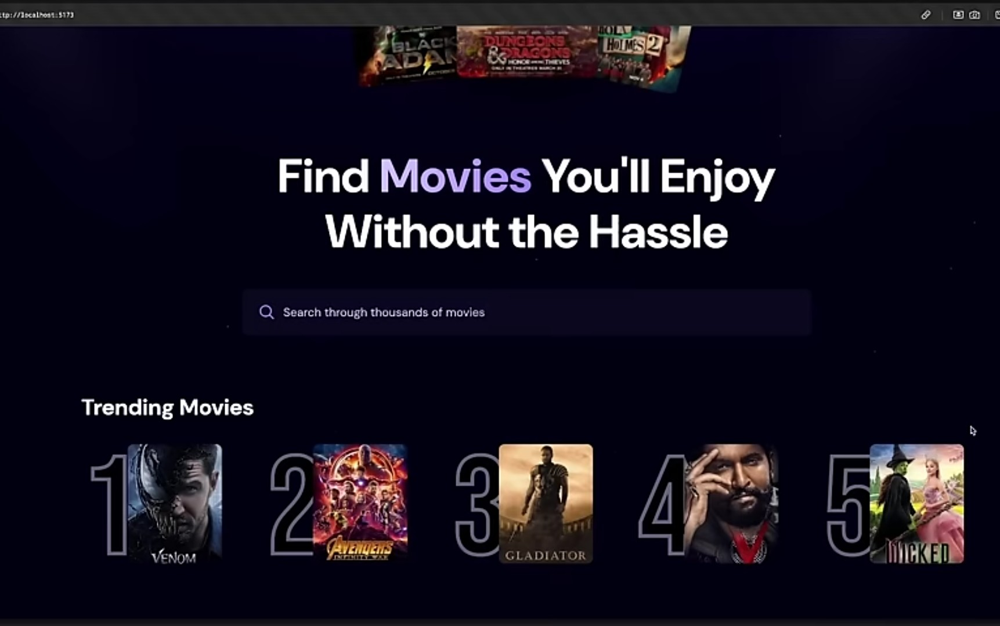
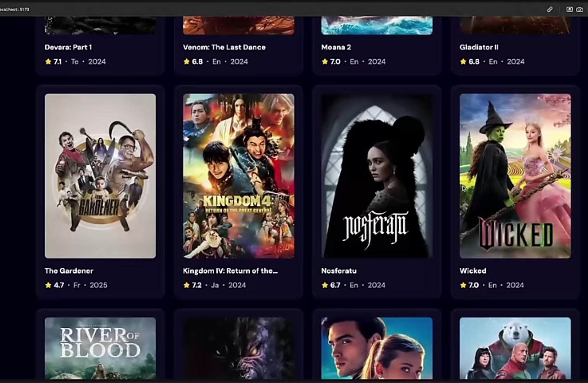
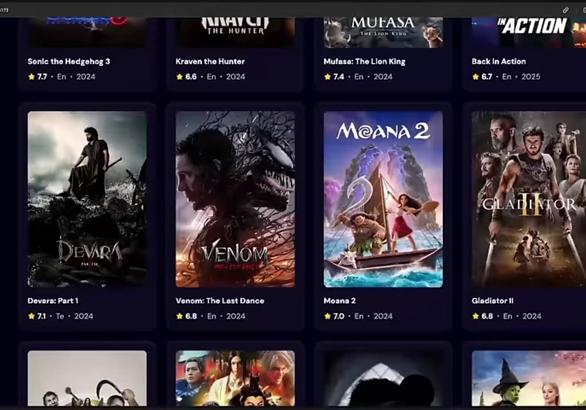
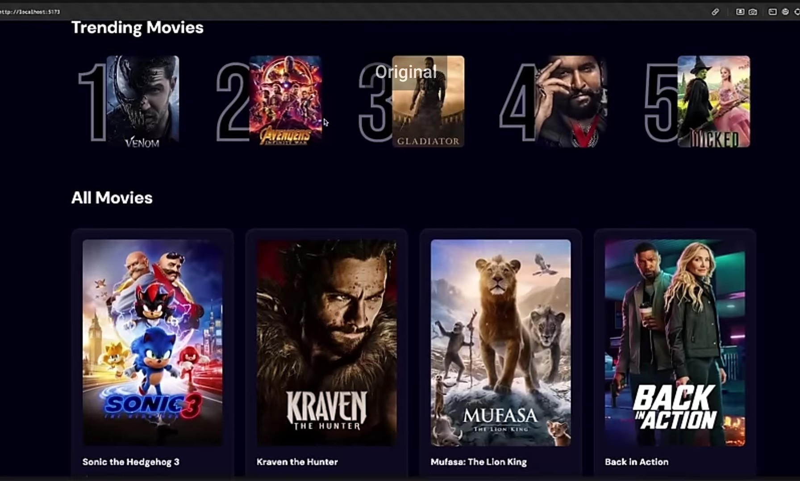

📽️ Movie App - React + Vite
A sleek and responsive movie search application built using React and Vite. This app provides a real search experience, displaying the top 5 recommended movies prominently while showcasing other search results dynamically.

🚀 Features
✅ Real-time Movie Search - Get instant search results based on user input.

✅ Top Movie Recommendations - Highlights the best-matching movies at the top.

✅ Modern UI with React - Smooth and responsive interface powered by React.

✅ Optimized Performance - Built with Vite for fast and efficient development.

✅ ESLint & Code Standards - Ensures clean and maintainable code.

🎬 Screenshots

 
 
 

 
  
 
 

 

⚙️ Tech Stack
Frontend: React, JavaScript, Vite

Styling: CSS (or Tailwind, if applicable)

Development Tools: ESLint, Prettier

📂 Project Setup
🔹 Installation & Setup

1️⃣ Clone the repository:
bash
Copy
Edit
git clone https://github.com/subashshanmugmam/CineSearchX.git

cd CineSearchX

2️⃣ Install dependencies:

bash
Copy
Edit
npm install

3️⃣ Start the development server:

bash
Copy
Edit
npm run dev

4️⃣ Open your browser and visit:

arduino
Copy
Edit
http://localhost:5173

🔧 Expanding the Project
If you are developing a production-ready application, consider:

Adding TypeScript for better type safety.

Enhancing Search Algorithm for more personalized recommendations.

Improving UI with Material UI / Tailwind CSS for better design.

Deploying to Vercel or Netlify for hosting the app online.

📜 License
This project is open-source and available under the MIT License.

🔥 Contributions are Welcome! If you have ideas or improvements, feel free to submit a pull request.
🚀 Happy coding!

